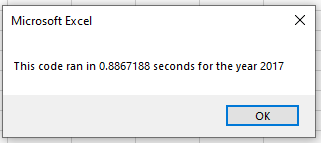
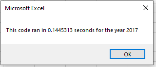
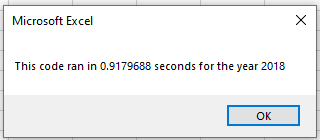

# VBA of Wallstreet

## Overview of Project
Steve loves the initial analysis workbook. At the click of a button, he can analyze an entire dataset. he wants to expand the dataset to include the entire stock market over the last few years. Although the initial code works well for a dozen stocks, it might not work as well for thousands of stocks. And if it does, it may take a long time to execute.

## Results
The new solution loops through all the data only one time in order to collect the same information.
Below are the steps:

1- The user enters the year for the dataset
>```yearValue = InputBox("What year would you like to run the analysis on?")```

2- Right after we start a timer to keep track of the performance
>```startTime = Timer```

3- Activate the report sheet "All Stocks Analysis" and create the report headers
```
Range("A1").Value = "All Stocks (" & yearValue & ")"
Cells(3, 1).Value = "Ticker"
Cells(3, 2).Value = "Total Daily Volume"
Cells(3, 3).Value = "Return"
```

4- Create and initialize an array for all tickers
Our data is ordered by date for each ticker. 
We initialize the tickers array in the same order as our data tickers.

```
Dim tickers(12) As String
tickers(0) = "AY"
tickers(1) = "CSIQ"
tickers(2) = "DQ"
tickers(3) = "ENPH"
tickers(4) = "FSLR"
tickers(5) = "HASI"
tickers(6) = "JKS"
tickers(7) = "RUN"
tickers(8) = "SEDG"
tickers(9) = "SPWR"
tickers(10) = "TERP"
tickers(11) = "VSLR"
```

5- Activate the worksheet for the desired year and get the last row in this sheet
```
Worksheets(yearValue).Activate
RowCount = Cells(Rows.Count, "A").End(xlUp).Row
```

6- Create arrays to store volumes, starting price and ending price for each ticker
```
Dim tickerVolumes(12) As Long
Dim tickerStartingPrices(12), tickerEndingPrices(12) As Single
```

7- Reset the tickerVolumes
```
For i = 0 To 11
  tickerVolumes(i) = 0
Next i
```

8- Initialize tickerIndex before the loop
>```tickerIndex = 0```

9- LOOP through the dataset set the current ticker and increase its volume
 ```
For i = 2 To RowCount
    ticker = tickers(tickerIndex)
    tickerVolumes(tickerIndex) = tickerVolumes(tickerIndex) + Cells(i, 8).Value
```
> Check if the current row is the first row of the current ticker to set the startingPrice
```
If Cells(i, 1).Value = ticker And Cells(i - 1, 1).Value <> ticker Then
    'set starting price
    tickerStartingPrices(tickerIndex) = Cells(i, 6).Value
End If
```
> Check if the current row is the last row of the current ticker to set the endingPrice and increase the tickerIndex
```
If Cells(i, 1).Value = ticker And Cells(i + 1, 1).Value <> ticker Then
     'set ending price
     tickerEndingPrices(tickerIndex) = Cells(i, 6).Value
     ' If the next row?s ticker doesn?t match, increase the tickerIndex
     tickerIndex = tickerIndex + 1
End If
``` 

10- Loop through the ticker arrays to print the report
```
For i = 0 To 11
    Worksheets("All Stocks Analysis").Activate
    Cells(4 + i, 1).Value = tickers(i)
    Cells(4 + i, 2).Value = tickerVolumes(i)
    Cells(4 + i, 3).Value = tickerEndingPrices(i) / tickerStartingPrices(i) - 1
Next i
```

11- Format the report
```
Range("A3:C3").Font.FontStyle = "Bold"
Range("A3:C3").Borders(xlEdgeBottom).LineStyle = xlContinuous
Range("B4:B15").NumberFormat = "#,##0"
Range("C4:C15").NumberFormat = "0.0%"
Columns("B").AutoFit
dataRowStart = 4
dataRowEnd = 15
For i = dataRowStart To dataRowEnd
    If Cells(i, 3) > 0 Then
        Cells(i, 3).Interior.Color = vbGreen
    Else
        Cells(i, 3).Interior.Color = vbRed
    End If
Next i
```

12- Capture the end time and print the processing time
```
endTime = Timer
MsgBox "This code ran in " & (endTime - startTime) & " seconds for the year " & (yearValue)
```


## Summary
The refactoring allowed the code clean-up and also improve the performance drastically as shown in the figures below








At the same time the refactoring added some further level of complexity with respect to the original code because of the need of nested loops and arrays to store intermediate results